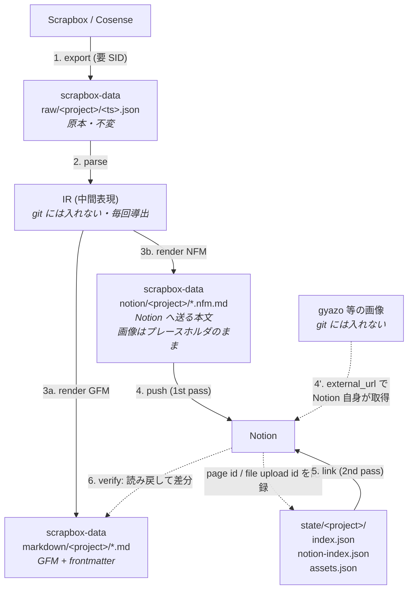

# Scrapbox (Cosense) → GitHub Markdown → Notion 移行計画

## 1. 目的とスコープ

Scrapbox から export したデータを

1. **GitHub 上に Markdown として保存**（`pollenjp/scrapbox-data`）
2. **それを元に Notion へページを作成**（Notion REST API）

する一連のスクリプトを `pollenjp/scrapbox` で管理する。Scrapbox は移行後も使い続けるので、1 回きりの移行ではなく**継続的な差分同期**として設計する。

| 対象 | リポジトリ | 可視性 |
| --- | --- | --- |
| 変換・投入スクリプト | `pollenjp/scrapbox` | public |
| export 原本・生成 Markdown・同期状態（画像バイナリは持たない） | `pollenjp/scrapbox-data` | **private** |

スクリプトが public、データが private という分割なので、**スクリプト側にプロジェクト名・ページタイトル・トークンを一切ハードコードしない**（すべて引数か環境変数）ことが設計上の制約になる。

## 決定事項

| # | 項目 | 決定 |
| --- | --- | --- |
| Q2 | Notion の投入先 | **個人ワークスペース**。接続済み MCP（会社ワークスペース「スリーシェイク」）は投入先ではないので**使わない**。個人ワークスペースの internal integration token を用意して REST API で投入する |
| Q3 | Notion 側の構造 | **データベース**。タイトル・作成日・更新日・タグをプロパティ化する（§6） |
| Q4 | 画像の扱い | **git 管理しない。Notion に直接アップロードし、対応関係だけを記録する**（§7） |
| Q5 | 移行後の Scrapbox | **更新を続ける**。1 回で終わる移行ではなく**継続的な差分同期**として設計する（§10・Phase 6） |

Q2 の帰結として、**Notion に触る処理はすべて REST API のローカル実行または GitHub Actions 実行**になる。MCP はパイロットにも使えない（別ワークスペースなので、そこに作ったページは成果物にならない）。

また「会社ワークスペースのトークンを誤って使うと私物が社内に出る」という事故が起こりうるので、`push` の先頭で **`GET /v1/users/me` を叩いて workspace が期待どおりかを検証し、違っていたら即座に abort する** preflight を入れる（§11 リスク #13）。

Q5 の帰結として、`state/` は「移行の記録」ではなく**継続運用される同期状態**になる。削除・リネームの扱いを最初から設計に入れる（§10.2）。

## 2. 調査で確定した前提

### 2.1 Scrapbox 側

- export は Menu → Settings → Page Data → Export Pages。`Include metadata` を有効にすると作成日時・更新日時が入る。API は `/api/page-data/export/:project.json`（private project は `connect.sid` cookie が必要）。
- export JSON はおおよそ次の形（`pages[].lines` の先頭要素がタイトル行）。**実データで確定させる**（→ Phase 1）。

  ```jsonc
  {
    "name": "<project>",
    "displayName": "...",
    "exported": 1750000000,
    "pages": [
      {
        "title": "ページタイトル",
        "id": "5f...",
        "created": 1600000000,
        "updated": 1700000000,
        "views": 12,
        "lines": ["ページタイトル", " 本文1", "  本文2"]
      }
    ]
  }
  ```

- import 側の上限は 1 ファイル 30MB。export も大きくなるので分割前提で扱う。

### 2.2 Notion 側

- REST API は **Markdown を直接受け付ける**。`POST /v1/pages` の `markdown` パラメータ（`children` / `content` と排他）。`properties.title` を省略すると先頭の `# h1` がタイトルになるが、**データベース配下に作る本計画ではタイトルは `properties` で明示的に渡す**（h1 に依存させない）。読み出しは `GET /v1/pages/{page_id}/markdown`、追記は `PATCH /v1/blocks/{page_id}/children`。
- API `2025-09-03` 以降、データベースは **database → data source → page** の階層になった。データベース配下にページを作るときの `parent` は `{"type": "data_source_id", "data_source_id": "…"}`。`create_database` のレスポンスから data source id を取り出して `state/` に保存する。
- 接続済み MCP はワークスペース「スリーシェイク」向けなので**本計画では使わない**（→ 決定事項 Q2）。
- ⚠️ `Notion-Version` ヘッダの値は情報が食い違っている（API 全体は `2025-09-03`、Markdown 系エンドポイントは `2026-03-11` が必要という記述もある）。**実装前に実リクエストで確定させる**（→ Phase 3 の spike）。
- 受け付ける Markdown は **Notion-flavored Markdown (NFM)** であり GitHub Flavored Markdown (GFM) と互換ではない（§5 参照）。
- リクエスト制限:

  | 項目 | 上限 |
  | --- | --- |
  | レート | 平均 3 req/sec（バースト許容）、超過は 429 + `rate_limited` |
  | 配列要素数 | 100 / 配列（`children` など） |
  | `rich_text` の `text.content` | 2,000 文字 |
  | payload | 1,000 ブロック / 500KB |

### 2.3 実行環境（重要）

この remote セッション（Claude Code on the web）の egress ポリシーで到達性を実測した結果:

| ホスト | 到達性 | 影響 |
| --- | --- | --- |
| `github.com` / `raw.githubusercontent.com` | ✅ | git 操作は可 |
| `scrapbox.io` | ❌ 403 (policy) | **export をこの環境から実行できない** |
| `api.notion.com` | ❌ 403 (policy) | **REST API push をこの環境から実行できない** |
| `gyazo.com` / `i.gyazo.com` | ❌ 403 (policy) | 画像を自前でダウンロードできない。ただし既定の `external_url` 経路では Notion 側が取りに行くので**影響しない**（§7.2） |
| Notion MCP | ✅（ただし別ワークスペース） | 投入先が個人ワークスペースなので**使わない** |

**この制約は「この Claude セッションの sandbox」に限った話で、GitHub Actions のランナーには適用されない。** Actions は通常のインターネットアクセスを持つので、export も push もそのまま実行できる。したがって:

- **この環境で完結できるのは JSON → Markdown の純変換とテスト**（外部通信なし）。開発とレビューはここでできる。
- **ネットワークを触るステージ（export / push）は「ローカル実行」または「GitHub Actions 実行」。** Q5（継続的な差分同期）を選んだので、最終的な定常運用は Actions に載せる（Phase 6）。
- この環境から直接通したい場合は、環境のネットワークポリシーに `scrapbox.io` と `api.notion.com` を追加する必要がある。必須ではない（Actions とローカルで足りる）。gyazo は §7.2 の経路 A では不要。

## 3. 全体アーキテクチャ

素直に「Scrapbox → GFM → Notion」と直列に繋ぐと、**GFM が両端に対して非可逆な最小公倍数になり二重に情報が落ちる**（Scrapbox のリンク意味論・`[* ]` のサイズ段階が GFM で消え、消えた状態から NFM を組み立て直す）。

そこで **1 つのパーサ → 1 つの中間表現 (IR) → 2 つのレンダラ** にする。GitHub 上の Markdown は「人間がレビューし diff を見るための成果物」、Notion への入力は同じ IR から NFM として生成し、**それも git にコミットして監査可能にする**。これで「GitHub に保存したものを元に Notion へ」という要件を、情報を落とさずに満たせる。



画像だけ `raw/` を経由しない。Scrapbox の export JSON には URL しか入っておらず、実体は gyazo 側にあるため、**Notion に URL を渡して直接取り込ませる**（§7）。ローカルにもリポジトリにもバイナリは残らない。

各ステージは独立した CLI サブコマンドで、**入力が同じなら出力が同じ（決定論的）**。だから `markdown/` の `git diff` は「Scrapbox 側の変更」か「変換ロジックの変更」のどちらかしか意味しない。

## 4. リポジトリ構成

### 4.1 `pollenjp/scrapbox`（スクリプト）

既存は `bookmarklet/` `css/` `script/` `templates/` のフラット構成で、`bookmarklet/` が自己完結した npm プロジェクト。同じ流儀でトップレベルに 1 ディレクトリ追加する。

```
scrapbox/
├── bookmarklet/            # 既存
├── css/                    # 既存
├── script/                 # 既存
├── templates/              # 既存
├── docs/
│   └── scrapbox-to-notion/
│       └── plan.md         # 本ドキュメント
└── scrapbox2notion/        # ★ 新規
    ├── README.md
    ├── package.json
    ├── tsconfig.json
    ├── .env.example
    ├── src/
    │   ├── cli.ts                  # エントリポイント (sb2n)
    │   ├── config.ts               # env / 引数の解決
    │   ├── commands/
    │   │   ├── export.ts
    │   │   ├── convert.ts
    │   │   ├── push.ts
    │   │   ├── link.ts
    │   │   └── verify.ts
    │   ├── scrapbox/
    │   │   ├── schema.ts           # export JSON の zod スキーマ + 型
    │   │   └── to-ir.ts            # scrapbox-parser AST → IR
    │   ├── ir/
    │   │   └── types.ts            # IR 定義（ここが仕様の中心）
    │   ├── render/
    │   │   ├── gfm.ts
    │   │   └── nfm.ts
    │   ├── notion/
    │   │   ├── client.ts           # レート制御・429 リトライ・チャンク分割
    │   │   ├── assets.ts           # 画像アップロードと assets.json
    │   │   └── index-store.ts      # 同期状態の read/write
    │   └── util/
    │       ├── slug.ts             # タイトル → ファイル名（可逆）
    │       └── logger.ts
    └── test/
        └── fixtures/               # 記法ごとの入出力スナップショット
```

### 4.2 `pollenjp/scrapbox-data`（データ）

```
scrapbox-data/
├── README.md                       # レイアウトと再生成手順
├── .gitignore                      # .cache/ など
├── .github/workflows/sync.yml      # 定期差分同期（Phase 6）
├── raw/
│   └── <project>/
│       └── 2026-07-30T120000Z.json # export 原本。追記のみ・書き換えない
├── markdown/
│   └── <project>/
│       └── <slug>.md               # GFM + YAML frontmatter（GitHub で読む用）
├── notion/
│   └── <project>/
│       └── <slug>.nfm.md           # Notion へ送る本文そのもの（監査・diff 用）
└── state/
    └── <project>/
        ├── index.json              # title ↔ slug ↔ scrapbox page id
        ├── notion-index.json       # scrapbox page id → notion page id + hash
        └── assets.json             # 元画像 URL → Notion file upload id（§7）
```

**画像バイナリは git 管理しない。** Notion に直接アップロードし、対応関係だけを `state/assets.json` に残す（§7）。git-lfs も不要。

方針:

- `raw/` は **immutable なスナップショット**。日時つきで積む。「最新」はファイル名順で決め、symlink は使わない（Windows 対策）。差分同期で「前回」と「今回」を突き合わせるので、少なくとも直近 2 世代は必ず残す。
- `markdown/` `notion/` は `raw/` から **完全に再生成可能**。手で編集しない（README に明記）。
- `state/` だけは Notion 側の副作用の記録なので再生成不可 → **最重要ファイル**。壊すと重複ページ・画像の重複アップロードを起こす。`Scrapbox ID` プロパティから再構築する手段は用意する（§6）が、あくまで復旧用。
- `raw/*.json` が数 MB を超えるなら git-lfs を検討する。それ以外にリポジトリを太らせるものは置かない。
- 画像の一時ダウンロードが必要になった場合の置き場は `--cache-dir`（既定は OS の temp）で、**このリポジトリの外**。誤コミットを避けるため `.gitignore` に `.cache/` も入れておく。

## 5. 記法変換表

Scrapbox → GFM → NFM。**GFM 列と NFM 列が違う行が、直列変換では壊れる箇所**。

| Scrapbox | 意味 | GFM (`markdown/`) | NFM (`notion/`) |
| --- | --- | --- | --- |
| 行頭の空白/タブ | インデント階層（Scrapbox の構造そのもの） | ネストした `-`（2 space 単位） | ネストした `-`（**タブ**単位） |
| `[*** text]` （行全体） | 最大サイズ＋太字 | `## text` | `## text` |
| `[** text]` （行全体） | 大サイズ＋太字 | `### text` | `### text` |
| `[* text]` （行全体） | 太字 | `#### text` | `#### text` |
| `[* text]` （行内） | 太字 | `**text**` | `**text**` |
| `[[text]]` | 太字（`[* ]` 相当） | `**text**` | `**text**` |
| `[/ text]` | 斜体 | `*text*` | `*text*` |
| `[- text]` | 打ち消し | `~~text~~` | `~~text~~` |
| `[_ text]` | 下線 | `<u>text</u>` | `<span underline="true">text</span>` |
| `[*/-_ text]` | 装飾の組み合わせ（順不同） | 入れ子で合成 | 入れ子で合成 |
| `[ページ名]` | 内部リンク | `[ページ名](./<slug>.md)` | **1st pass: プレーン文字列 → 2nd pass: `<mention-page url="…">ページ名</mention-page>`** |
| `#tag` | ハッシュタグ（＝内部リンク） | frontmatter `tags` + 本文は `[#tag](./<slug>.md)` | 内部リンクと同じ扱い |
| `[/other-project/page]` | 他プロジェクトリンク | 絶対 URL リンク | 絶対 URL リンク |
| `[https://…]` | 外部リンク | `<https://…>` | `[https://…](https://…)` |
| `[https://… ラベル]` / `[ラベル https://…]` | ラベル付きリンク | `[ラベル](https://…)` | `[ラベル](https://…)` |
| `[https://….png]` | 画像埋め込み | `` （**元 URL のまま**） | `` → push 時に解決（§7） |
| `[https://link https://….png]` | 画像リンク | `[](link)` | 画像 + キャプションにリンク（NFM は画像にリンクを張れない → 要妥協） |
| `` `code` `` | インラインコード | `` `code` `` | `` `code` `` |
| `code:name` + インデント行 | コードブロック | ```` ```lang ```` （`name` の拡張子から言語推定） | 同じ（`name` は直前に太字行で出す） |
| `table:name` + タブ区切り行 | テーブル | GFM パイプテーブル | **`<table><tr><td>` XML**（NFM はパイプテーブル非対応） |
| `>text` | 引用 | `> text` | `> text`（複数行は改行ではなく `<br>` で連結） |
| `[$ x^2]` | インライン数式 | `$x^2$` | ``$`x^2`$`` |
| 素の URL | 自動リンク | そのまま | そのまま |
| `[user.icon]` | ユーザ/ページアイコン | **要判断**（削除 / `@user` テキスト化 / 画像化） | 同上 |
| 空行 | 空行 | 空行 | **`<empty-block/>`**（素の空行は除去される） |

NFM 固有の注意（公式 spec より）:

- インデントは**タブ**。
- エスケープが必要な文字: `` \ * ~ ` $ [ ] < > { } | ^ ``。ただし**コードブロック内はエスケープ禁止**（リテラル）。
- 見出しは `####` まで。`#####` 以降は h4 に丸められる。
- インラインコード内に生の改行を入れると壊れる → `<br>`。
- 箇条書き項目に inline rich text がないと空項目に見える。

### `[* ]` を見出しに昇格させるルール

Scrapbox の `[* ]` は「見出し」ではなく「サイズ付き太字」だが、実運用では見出しとして使われている。**行全体を覆っている装飾だけを見出しに昇格し、行内なら太字のまま**にする。これが誤爆が最も少ない。`convert --heading-mode {promote|bold}` で切り替えられるようにして、実データを見て決める。

## 6. Notion データベーススキーマ

Q3 の決定に従い、プロジェクトごとに 1 データベースを作る（`sb2n init-db --project <name>`）。プロパティは Scrapbox の metadata をそのまま検索軸にできるものだけに絞る。

| プロパティ | 型 | 由来 | 用途 |
| --- | --- | --- | --- |
| `Title` | `title` | `pages[].title` | ページ名。**主キーではない**（リネームされる） |
| `Created` | `date` | `pages[].created` (unix → ISO8601) | 時系列で並べる |
| `Updated` | `date` | `pages[].updated` | 最近触ったものを出す |
| `Tags` | `multi_select` | 本文の `#tag` | Scrapbox のタグ検索の代替 |
| `Scrapbox ID` | `rich_text` | `pages[].id` | **突き合わせの主キー**。差分同期でこれを引く |
| `Scrapbox URL` | `url` | 構築 | 原本へ戻れるようにする |
| `Views` | `number` | `pages[].views` | 参考情報（同期対象外にしてもよい） |
| `Synced At` | `date` | 同期実行時刻 | 同期漏れの検出 |

補足:

- **`Scrapbox ID` にインデックス代わりのフィルタを効かせて突き合わせる**が、Notion にユニーク制約はないので重複は防げない。重複防止は `state/notion-index.json` 側の責務（§10）。`Scrapbox ID` プロパティは state ファイルを失った場合の復旧手段（Notion 側だけから index を再構築できる）として持つ。
- `Views` は Scrapbox 側で常に増えるので、これを同期対象にすると**全ページが毎回更新扱いになる**。`content_hash` の計算対象から `views` を除外する（§10）。
- Scrapbox の「関連ページ（2 hop リンク）」に相当する機能は Notion にないので、`links` はプロパティにせず本文末尾の「関連ページ」セクションとして展開する（`--related-section`）。relation プロパティで表現する案もあるが、全ページ作成後に relation を張り直す 3rd pass が必要になるので初期スコープから外す。

## 7. 画像の扱い

**方針: バイナリは git 管理しない。Notion に直接アップロードし、対応関係だけを `state/<project>/assets.json` に残す。**

### 7.1 「アップロードした URL を保存」の落とし穴

保存するのは URL **ではなく `file_upload_id`**。Notion がファイルに対して返す S3 URL は**署名付きで約 1 時間で失効する**（`X-Amz-Expires=3600` と `expiry_time` が付く）。URL だけを控えても翌日には使えない。

永続するのは file upload の id で、file object は `{"type": "file_upload", "file_upload": {"id": "…"}}` という形を取る。**再利用・再アタッチに使えるのはこの id だけ**なので、これを主たる記録にする。URL は「そのとき何が返ってきたか」のデバッグ用として、失効時刻とセットで併記する（＝最初から切れている前提の参考情報として持つ）。

もう一つ制約がある。**どのページにも添付されていない file upload は期限切れで削除される。** したがってアップロードは投入と同じ実行の中で行い、投げっぱなしにしない（§7.3）。

### 7.2 アップロード経路

| 経路 | 使う場面 | 手順 |
| --- | --- | --- |
| **A. `external_url`（既定）** | 公開画像（通常の gyazo はこちら） | Notion に URL を渡して**取りに行かせる**。ローカルにダウンロードしない |
| **B. ローカルアップロード（フォールバック）** | 非公開・要認証・リダイレクトする URL | 一度ダウンロードして single-part upload。キャッシュは `--cache-dir`（既定は OS の temp、**リポジトリ外**） |

経路 A が既定なのが効く点が 2 つある。**ダウンロードが要らないのでローカルにバイナリが残らない**（今回の要件そのもの）。そして**取得しに行くのは Notion のサーバなので、実行環境から gyazo に到達できるかどうかが無関係になる**（§2.3 の gyazo egress 403 が経路 A では問題にならない。api.notion.com には到達する必要がある）。

経路 A の要件は「SSL・公開アクセス可能・`Content-Type` ヘッダを返す・リダイレクトしない」。満たさなければ経路 B に落ちる。

### 7.3 パイプライン上の位置

上の「未アタッチの upload は消える」制約から、**アップロードは `convert` ではなく `push` で行う**。

- `convert`（オフライン・ネットワーク不要）: 画像に触らない。GFM は**元 URL をそのまま**参照し、NFM には `⟦asset:<元 URL>⟧` プレースホルダを置く。
- `push`: ページを作る/更新する直前に、そのページが使う画像を `assets.json` に照会 → 未登録ならアップロード → プレースホルダを解決して投入。

この分割には副次的な利点がある。`convert` が完全にオフラインになるので**この Claude セッションでも CI でも回せる**。そして `notion/*.nfm.md` はプレースホルダのまま commit されるため、**file upload id が変わっても diff が出ない**（毎回全ページが更新扱いになるのを防ぐ）。

GFM 側が元 URL を参照するのは、`markdown/` を「Scrapbox の内容の Markdown 表現」として素直に保つため。公開画像なら GitHub 上でもそのまま表示される。

### 7.4 記録フォーマット

`state/<project>/assets.json`:

```jsonc
{
  "version": 1,
  "assets": {
    "https://i.gyazo.com/abc123.png": {          // 元 URL が主キー
      "file_upload_id": "43833259-72ae-…",       // ★ 永続。再利用するのはこれ
      "notion_url": "https://prod-files-secure.s3…",   // 参考情報（失効済み前提）
      "notion_url_expires_at": "2026-07-30T13:00:00Z",
      "upload_path": "external_url",             // external_url | local
      "content_type": "image/png",
      "size_bytes": 123456,
      "sha256": "…",                             // 経路 B で実体を通したときのみ
      "uploaded_at": "2026-07-30T12:00:00Z",
      "used_by": ["5f8a…"],                      // 使っている Scrapbox page id
      "status": "uploaded"                       // uploaded | failed | unavailable
    }
  }
}
```

**主キーを sha256 ではなく元 URL にした理由**: sha256 を主キーにすると重複判定のために毎回ダウンロードが必要になり、経路 A の利点（ダウンロード不要）が消える。gyazo の URL は実質コンテンツアドレスなので、URL 一致でほぼ同一とみなして問題ない。sha256 は経路 B で実体を通したときだけ記録する。

これにより**定常同期では画像に一切触らない**（`assets.json` にヒットすれば `file_upload_id` を使い回すだけ）。

### 7.5 失敗したとき

サイズ超過・非公開・リンク切れでアップロードできない画像は、**ページ全体を失敗させない**。`status` に理由を記録し、Notion 側には元 URL をプレーンなリンクとして出す（情報を落とさない）。失敗した画像は `push` のレポートに一覧で出す。

## 8. Frontmatter 仕様

GFM 側に持たせる。これで `markdown/` 単体でも情報が落ちない。

```yaml
---
title: "元のページタイトル"          # slug 化前の生タイトル
scrapbox:
  project: "<project>"
  id: "5f8a…"
  url: "https://scrapbox.io/<project>/<percent-encoded-title>"
  created: 2020-09-13T12:26:40Z
  updated: 2023-11-14T09:00:00Z
  views: 12
links: ["リンク先ページA", "リンク先ページB"]   # 本文中の内部リンク
tags: ["tag1"]                                  # #tag
source_snapshot: "raw/<project>/2026-07-30T120000Z.json"
content_hash: "sha256:ab12…"                    # push 差分判定用
---
```

## 9. CLI 仕様

```bash
# 0. 投入先データベースを作る（初回のみ。data source id を state に保存）
sb2n init-db --project <name> --parent <notion-page-id>

# 1. export（★要ネットワーク。要 SCRAPBOX_SID）
sb2n export --project <name> --out-dir $DATA/raw/<name>

# 2. 変換（★通信なし。この環境でも CI でも実行可）
sb2n convert --snapshot $DATA/raw/<name>/<ts>.json --data-dir $DATA \
             [--heading-mode promote|bold] [--related-section]

# 3. Notion へ投入 1st pass（画像のアップロードもここで行う。要 NOTION_TOKEN）
sb2n push --project <name> [--dry-run] [--limit N] [--only <slug>] [--force] \
          [--cache-dir <path>] [--skip-assets]

# 4. 内部リンク解決（2nd pass）
sb2n link --project <name> [--dry-run]

# 5. 検証（Notion から読み戻して期待 NFM と差分）
sb2n verify --project <name> [--sample N]

# 6. 定常運用: 1〜5 を差分だけまとめて回す（Phase 6 / Actions から呼ぶ）
sb2n sync --project <name> [--dry-run] [--prune]
```

`push` は投入先を `state/<project>/notion-index.json` の `notion_data_source_id` から読む（`init-db` が書く）。**コマンドラインにデフォルトの投入先を持たせない** —— 取り違えると私物が別ワークスペースに出るため。

環境変数（すべて `.env`、`.gitignore` 済み。**リポジトリには絶対に入れない**。Actions では repository secrets）:

| 変数 | 用途 |
| --- | --- |
| `SCRAPBOX_SID` | private project の export（`connect.sid`）。**有効期限があるので切れる前提**（§11 #14） |
| `NOTION_TOKEN` | **個人ワークスペース**の internal integration token |
| `NOTION_EXPECTED_WORKSPACE_ID` | preflight 検証用。トークンの所属ワークスペースがこれと違えば abort |
| `SCRAPBOX_DATA_DIR` | `scrapbox-data` の checkout パス |

## 10. 冪等性・差分同期・状態管理

Scrapbox は数百〜数千ページになりうるので、**途中で落ちる前提**で設計する。加えて Q5（更新を続ける）を選んだので、**1 回きりの移行ではなく繰り返し回るもの**として設計する。

### 10.1 状態ファイル

`state/<project>/notion-index.json`:

```jsonc
{
  "project": "<project>",
  "notion_workspace_id": "…",            // preflight で照合する
  "notion_database_id": "…",
  "notion_data_source_id": "…",          // ページ作成時の parent
  "last_synced_snapshot": "raw/<project>/2026-07-30T120000Z.json",
  "pages": {
    "5f8a…": {                           // scrapbox page id が主キー
      "title": "ページタイトル",
      "slug": "…",
      "notion_page_id": "1a2b…",
      "notion_url": "https://www.notion.so/…",
      "content_hash": "sha256:ab12…",    // push 済み本文のハッシュ
      "links_resolved": true,            // 2nd pass 完了フラグ
      "pushed_at": "2026-07-30T12:00:00Z",
      "status": "ok"                     // ok | failed | archived
    }
  }
}
```

- `content_hash` が一致 → **スキップ**。2 回目以降の実行はほぼ無料。差分同期がこれで成り立つ。
- **ハッシュの計算対象は NFM 本文と同期対象プロパティのみ。`views` と `Synced At` は除外する。** 含めると閲覧数が増えるだけで全ページが更新扱いになり、毎回フル同期になってしまう。
- 主キーは Scrapbox page id。タイトル変更でも同じ Notion ページを更新できる（タイトルを主キーにすると別ページが増える）。
- 1 ページ push ごとに state を書き出す（バッチ末尾でまとめて書かない）。落ちても進捗が残る。
- `status: failed` のページだけ再試行できるようにする。

### 10.2 差分同期: 追加・更新・リネーム・削除

`sync` は「前回の snapshot」と「今回の snapshot」を Scrapbox page id で突き合わせて 4 分類する。

| 分類 | 判定 | 動作 |
| --- | --- | --- |
| **追加** | 今回のみに id がある | ページを作成（1st pass 相当）→ 新規リンクがあるので 2nd pass も回す |
| **更新** | 両方にあり `content_hash` が変わった | 本文を差し替え（`update_page`）+ プロパティ更新 |
| **リネーム** | 両方にあり `title` だけ変わった | `Title` プロパティを更新。**Notion ページは作り直さない**。`markdown/` 側はファイル名が変わるので git 上は rename として出る |
| **削除** | 前回のみに id がある | **アーカイブする（`archived: true`）。ページを削除しない。** `status: "archived"` を記録し、id は state に残す |

削除で **archive を選ぶ理由**: Scrapbox の削除が意図的かどうかスクリプトからは判別できず、Notion 側で加筆されている可能性もある。破壊的操作は避け、`sync --prune` を明示的に付けたときだけ archive する。archive すら望まない場合は何もせずレポートに出すだけにする。

同じ id が復活した場合（archive 済みページに対応する id が再登場）は、archive を解除して更新する。

### 10.3 内部リンクを 2 pass にする理由

Scrapbox は相互リンクの塊なので、A→B のリンクを張る時点で B の Notion page id が必要になる。循環があるので 1 pass では解けない。

- **1st pass**: 全ページを作成。内部リンクは**プレーンテキストのまま**残す（`⟦ページ名⟧` のような一意なマーカーで囲む）。
- **2nd pass**: `notion-index.json` が埋まった状態で、マーカーを `<mention-page url="…">` に置換して `update_page`。

Scrapbox に存在しないページへのリンク（未作成リンク）は Notion に対応物がないので、**プレーンテキストに落とす**（マーカーだけ外す）。

## 11. リスクと対策

| # | リスク | 対策 |
| --- | --- | --- |
| 1 | この Claude セッションから `scrapbox.io` / `api.notion.com` が egress 403 | export・push はローカルまたは GitHub Actions で実行（Actions のランナーには制約が及ばない）。この環境では変換とテストのみ回す |
| 2 | Notion レート制限（3 req/s） | トークンバケットで送出、429 は `Retry-After` を尊重した指数バックオフ。全体で ~2.5 req/s を上限に |
| 3 | 100 要素 / 2,000 文字 / 500KB の制限 | 長いページは `create` + 複数回 `append` に分割。2,000 文字超のテキスト run は分割。ブロック数を事前に見積もって切る |
| 4 | Markdown API の `Notion-Version` が不確定 | Phase 3 冒頭に **1 ページだけ実 POST する spike** を置いて確定させる。ここで NFM のパイプテーブル受理可否も同時に確認 |
| 5 | **Notion が返すファイル URL は約 1 時間で失効する**（署名付き S3 URL） | URL ではなく **`file_upload_id` を `state/assets.json` の主記録にする**。URL は失効時刻とセットで参考情報として併記（§7.1） |
| 6 | **どのページにも添付されていない file upload は期限切れで削除される** | アップロードを `convert` ではなく `push` の中で行い、投入と同じ実行内で必ずアタッチする（§7.3） |
| 7 | gyazo 画像が非公開・要認証で `external_url` 経路に失敗する | 経路 B（ローカルにダウンロードして upload）へフォールバック。それも無理なら `status: unavailable` を記録し、Notion には元 URL をプレーンリンクとして出して**ページ自体は成功させる**（§7.5） |
| 8 | ファイルサイズ上限（`external_url` は無料 5 MiB / 有料 50 MiB、single-part upload は 20 MiB） | **個人ワークスペースのプランを Phase 3 で確認する**。超過分は `status: unavailable` として元 URL リンクに落とし、レポートに一覧化 |
| 9 | タイトル → ファイル名（`/ ? * : \| < > \` 空白、Unicode、macOS/Windows の大文字小文字衝突） | 危険文字のみ percent-encoding で**可逆**に。衝突時は `-2` サフィックス。対応は `state/index.json` で持つ（推測に頼らない） |
| 10 | Scrapbox の「関連ページ（2 hop リンク）」が Notion に無い | frontmatter の `links` を元に、ページ末尾へ「関連ページ」セクションを自動生成（`--related-section` フラグ） |
| 11 | 変換ミスに気づかないまま数千ページ流し込む | Phase 3 で 10 ページのパイロット → 目視 → マッピング修正。`--dry-run` を全コマンドに用意 |
| 12 | 個人メモを会社ワークスペース（スリーシェイク）に入れてしまう | 投入先は**個人ワークスペース**に確定済み。加えて #13 の preflight で機械的に防ぐ |
| 13 | `NOTION_TOKEN` を取り違えて別ワークスペースへ書き込む | `push` / `link` / `sync` の先頭で `GET /v1/users/me` を叩き、workspace id が `NOTION_EXPECTED_WORKSPACE_ID`（および state の `notion_workspace_id`）と一致しなければ **1 件も書かずに abort**。書き込み前に必ず通す |
| 14 | `SCRAPBOX_SID` の有効期限切れで定期同期が黙って壊れる | `export` は認証失敗（ログイン HTML が返る等）を JSON パース前に検知して**明示的に失敗させる**。Actions ではジョブを fail させて通知が飛ぶようにする。「0 ページ取得できたので差分なし」と誤認して全ページ削除扱いにするのが最悪パターンなので、**取得ページ数が前回より一定割合以上減ったら abort する sanity check** を入れる |
| 15 | 差分同期が Scrapbox の削除を検知して Notion 側の加筆を消す | 削除は archive のみ・`--prune` 明示時のみ（§10.2）。ページ削除は行わない |

## 12. フェーズ計画

| Phase | 内容 | 完了条件 | 実行場所 |
| --- | --- | --- | --- |
| **0** | 残る判断事項の確定（§13） | Q1・Q6 が確定 | — |
| **1** | `scrapbox-data` の骨組み + export | `raw/<project>/<ts>.json` が commit 済み。実 JSON でスキーマ確定 | ローカル |
| **2** | parse → IR → GFM | `markdown/` が commit され GitHub 上で読める。記法ごとの fixture テストが green | **完全オフライン**（この環境でも CI でも可） |
| **3** | `init-db` + NFM renderer + 画像アップロード + **10 ページのパイロット** | Notion 上で 10 ページを目視確認 → マッピング修正が反映済み。`Notion-Version` 確定。preflight が機能することを確認。**画像を含むページを必ず 1 枚以上入れ、`external_url` 経路とワークスペースのファイルサイズ上限を実測する** | ローカル |
| **4** | 全ページ移行（1st pass） | 全ページ `status: ok`。失敗ページ一覧が出る | ローカル |
| **5** | 内部リンク解決（2nd pass） | `links_resolved: true` が全ページ。未解決リンクが一覧化 | ローカル |
| **6** | **差分同期の自動化**（Q5 で必須になった） | `sync` が追加・更新・リネーム・削除の 4 分類を正しく扱う。`scrapbox-data` の Actions で定期実行され、`raw/` `markdown/` `notion/` `state/` の更新が PR として出る。`verify` の差分がレビュー済み | GitHub Actions |

Phase 2 で一度止まって GitHub 上の Markdown をレビューできるのが、この 2 段構成の一番の利点。Notion に流す前に変換品質を確定できる。

### Phase 6 の構成（Q5 = 更新を続ける）

ワークフローは `scrapbox-data` 側に置く（データがそこにあり、secrets もそこに置くのが自然）。`scrapbox2notion` は public なので checkout するだけで使える。

```yaml
# scrapbox-data/.github/workflows/sync.yml （骨子）
on:
  schedule: [{cron: "17 3 * * *"}]   # 毎日 1 回
  workflow_dispatch:
jobs:
  sync:
    steps:
      - uses: actions/checkout@v4                      # scrapbox-data
      - uses: actions/checkout@v4                      # ツール
        with: {repository: pollenjp/scrapbox, path: .tool}
      - run: npm ci && npm run build
        working-directory: .tool/scrapbox2notion
      - run: sb2n sync --project "$PROJECT"
        env:
          SCRAPBOX_SID: ${{ secrets.SCRAPBOX_SID }}
          NOTION_TOKEN: ${{ secrets.NOTION_TOKEN }}
          NOTION_EXPECTED_WORKSPACE_ID: ${{ secrets.NOTION_EXPECTED_WORKSPACE_ID }}
      - uses: peter-evans/create-pull-request@v6       # 差分を PR にする
```

**同期結果を直 push ではなく PR にする**のが要点。`markdown/` の diff が「Scrapbox 側で何が変わったか」のレビュー可能な記録になり、変換ロジックのリグレッションにも気づける。`state/` の変更も同じ PR に乗るので、Notion 側に何をしたかが追える。

## 13. 判断事項

確定済み（→ 冒頭「決定事項」）: **Q2 個人ワークスペース** / **Q3 データベース** / **Q4 画像は git 管理せず Notion へ直接アップロード** / **Q5 更新を続ける（差分同期あり）**。

残るもの:

| # | 内容 | 推奨 |
| --- | --- | --- |
| **Q1** | Scrapbox のプロジェクト名。複数あるか | ディレクトリを project 単位で切ってあるので複数可。Phase 1 で必要 |
| **Q6** | 実装言語 | **TypeScript / Node 22**。既存 `bookmarklet/` と揃うことより、[`@progfay/scrapbox-parser`](https://github.com/progfay/scrapbox-parser) という実績あるパーサをそのまま使える点が大きい（記法パーサを自作しないのが最大のリスク削減）。Rust の [`sb2ofmd`](https://github.com/uni-3/sb2ofmd) は Obsidian 向けだが変換ルールの参考になる |

## 14. 参考

- [Importing and exporting data - Cosense Help](https://scrapbox.io/help/Importing_and_exporting_data)
- [scrapbox json data - takker](https://scrapbox.io/takker/scrapbox_json_data)
- [Scrapbox REST API の一覧 - Cosense研究会](https://scrapbox.io/scrapboxlab/Scrapbox_REST_API%E3%81%AE%E4%B8%80%E8%A6%A7)
- [ブラケティング - Cosense ヘルプ](https://scrapbox.io/help-jp/%E3%83%96%E3%83%A9%E3%82%B1%E3%83%86%E3%82%A3%E3%83%B3%E3%82%B0) / [テーブル記法](https://scrapbox.io/support-doc-jp/%E3%83%86%E3%83%BC%E3%83%96%E3%83%AB%E8%A8%98%E6%B3%95)
- [Working with markdown content - Notion Docs](https://developers.notion.com/guides/data-apis/working-with-markdown-content)
- [Request limits - Notion Docs](https://developers.notion.com/reference/request-limits)
- Notion-flavored Markdown 仕様: MCP リソース `notion://docs/enhanced-markdown-spec`
- [`@progfay/scrapbox-parser`](https://github.com/progfay/scrapbox-parser) / [`uni-3/sb2ofmd`](https://github.com/uni-3/sb2ofmd) / [`kazurego7/cosense_exporter`](https://github.com/kazurego7/cosense_exporter) / [`takahashim/cosensee`](https://github.com/takahashim/cosensee)
