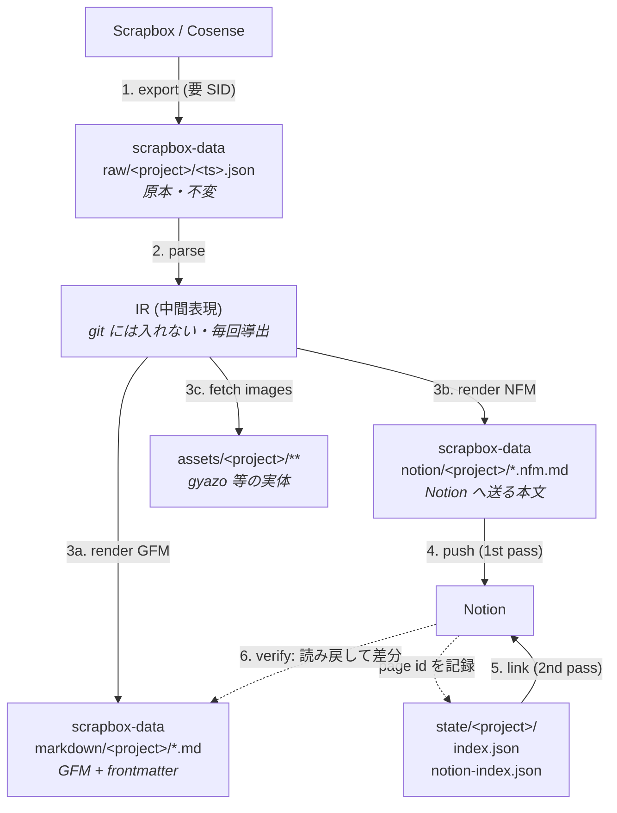

# Scrapbox (Cosense) → GitHub Markdown → Notion 移行計画

## 1. 目的とスコープ

Scrapbox から export したデータを

1. **GitHub 上に Markdown として保存**（`pollenjp/scrapbox-data`）
2. **それを元に Notion へページを作成**（Notion API / Notion MCP）

する一連のスクリプトを `pollenjp/scrapbox` で管理する。

| 対象 | リポジトリ | 可視性 |
| --- | --- | --- |
| 変換・投入スクリプト | `pollenjp/scrapbox` | public |
| export 原本・生成 Markdown・画像・移行状態 | `pollenjp/scrapbox-data` | **private** |

スクリプトが public、データが private という分割なので、**スクリプト側にプロジェクト名・ページタイトル・トークンを一切ハードコードしない**（すべて引数か環境変数）ことが設計上の制約になる。

## 2. 調査で確定した前提

### 2.1 Scrapbox 側

- export は Menu → Settings → Page Data → Export Pages。`Include metadata` を有効にすると作成日時・更新日時が入る。API は `/api/page-data/export/:project.json`（private project は `connect.sid` cookie が必要）。
- export JSON はおおよそ次の形（`pages[].lines` の先頭要素がタイトル行）。**実データで確定させる**（→ Phase 1）。

  ```jsonc
  {
    "name": "<project>",
    "displayName": "...",
    "exported": 1750000000,
    "pages": [
      {
        "title": "ページタイトル",
        "id": "5f...",
        "created": 1600000000,
        "updated": 1700000000,
        "views": 12,
        "lines": ["ページタイトル", " 本文1", "  本文2"]
      }
    ]
  }
  ```

- import 側の上限は 1 ファイル 30MB。export も大きくなるので分割前提で扱う。

### 2.2 Notion 側

- MCP は **ワークスペース「スリーシェイク」** に接続済み（`create_pages` / `update_page` / `create_database` すべて available）。
- REST API は **Markdown を直接受け付ける**。`POST /v1/pages` の `markdown` パラメータ（`children` / `content` と排他）。`properties.title` を省略すると先頭の `# h1` がタイトルになる。読み出しは `GET /v1/pages/{page_id}/markdown`、追記は `PATCH /v1/blocks/{page_id}/children`。
- ⚠️ `Notion-Version` ヘッダの値は情報が食い違っている（API 全体は `2025-09-03`、Markdown 系エンドポイントは `2026-03-11` が必要という記述もある）。**実装前に実リクエストで確定させる**（→ Phase 3 の spike）。
- 受け付ける Markdown は **Notion-flavored Markdown (NFM)** であり GitHub Flavored Markdown (GFM) と互換ではない（§5 参照）。
- リクエスト制限:

  | 項目 | 上限 |
  | --- | --- |
  | レート | 平均 3 req/sec（バースト許容）、超過は 429 + `rate_limited` |
  | 配列要素数 | 100 / 配列（`children` など） |
  | `rich_text` の `text.content` | 2,000 文字 |
  | payload | 1,000 ブロック / 500KB |

### 2.3 実行環境（重要）

この remote セッション（Claude Code on the web）の egress ポリシーで到達性を実測した結果:

| ホスト | 到達性 | 影響 |
| --- | --- | --- |
| `github.com` / `raw.githubusercontent.com` | ✅ | git 操作は可 |
| `scrapbox.io` | ❌ 403 (policy) | **export をこの環境から実行できない** |
| `api.notion.com` | ❌ 403 (policy) | **REST API push をこの環境から実行できない** |
| `gyazo.com` / `i.gyazo.com` | ❌ 403 (policy) | **画像ダウンロードをこの環境から実行できない** |
| Notion MCP | ✅ | MCP 経由の push のみ可 |

したがって

- **ネットワークを触るステージ（export / 画像取得 / REST push）はローカル実行が前提。**
- この環境で完結できるのは **JSON → Markdown の純変換とテスト**（外部通信なし）。CI もここだけなら回せる。
- どうしても remote から通したい場合の選択肢は (a) 環境のネットワークポリシーに `scrapbox.io` / `api.notion.com` / `gyazo.com` を追加、(b) push を Notion MCP 経由にする、の 2 つ。(b) はエージェント駆動なので冪等性・大量処理・再開に向かない → **パイロットと目視確認用に限定**するのが妥当。

## 3. 全体アーキテクチャ

素直に「Scrapbox → GFM → Notion」と直列に繋ぐと、**GFM が両端に対して非可逆な最小公倍数になり二重に情報が落ちる**（Scrapbox のリンク意味論・`[* ]` のサイズ段階が GFM で消え、消えた状態から NFM を組み立て直す）。

そこで **1 つのパーサ → 1 つの中間表現 (IR) → 2 つのレンダラ** にする。GitHub 上の Markdown は「人間がレビューし diff を見るための成果物」、Notion への入力は同じ IR から NFM として生成し、**それも git にコミットして監査可能にする**。これで「GitHub に保存したものを元に Notion へ」という要件を、情報を落とさずに満たせる。



各ステージは独立した CLI サブコマンドで、**入力が同じなら出力が同じ（決定論的）**。だから `markdown/` の `git diff` は「Scrapbox 側の変更」か「変換ロジックの変更」のどちらかしか意味しない。

## 4. リポジトリ構成

### 4.1 `pollenjp/scrapbox`（スクリプト）

既存は `bookmarklet/` `css/` `script/` `templates/` のフラット構成で、`bookmarklet/` が自己完結した npm プロジェクト。同じ流儀でトップレベルに 1 ディレクトリ追加する。

```
scrapbox/
├── bookmarklet/            # 既存
├── css/                    # 既存
├── script/                 # 既存
├── templates/              # 既存
├── docs/
│   └── scrapbox-to-notion/
│       └── plan.md         # 本ドキュメント
└── scrapbox2notion/        # ★ 新規
    ├── README.md
    ├── package.json
    ├── tsconfig.json
    ├── .env.example
    ├── src/
    │   ├── cli.ts                  # エントリポイント (sb2n)
    │   ├── config.ts               # env / 引数の解決
    │   ├── commands/
    │   │   ├── export.ts
    │   │   ├── convert.ts
    │   │   ├── push.ts
    │   │   ├── link.ts
    │   │   └── verify.ts
    │   ├── scrapbox/
    │   │   ├── schema.ts           # export JSON の zod スキーマ + 型
    │   │   └── to-ir.ts            # scrapbox-parser AST → IR
    │   ├── ir/
    │   │   └── types.ts            # IR 定義（ここが仕様の中心）
    │   ├── render/
    │   │   ├── gfm.ts
    │   │   └── nfm.ts
    │   ├── notion/
    │   │   ├── client.ts           # レート制御・429 リトライ・チャンク分割
    │   │   └── index-store.ts      # 移行状態の read/write
    │   └── util/
    │       ├── slug.ts             # タイトル → ファイル名（可逆）
    │       └── logger.ts
    └── test/
        └── fixtures/               # 記法ごとの入出力スナップショット
```

### 4.2 `pollenjp/scrapbox-data`（データ）

```
scrapbox-data/
├── README.md                       # レイアウトと再生成手順
├── .gitattributes                  # assets を git-lfs に
├── raw/
│   └── <project>/
│       └── 2026-07-30T120000Z.json # export 原本。追記のみ・書き換えない
├── markdown/
│   └── <project>/
│       └── <slug>.md               # GFM + YAML frontmatter（GitHub で読む用）
├── notion/
│   └── <project>/
│       └── <slug>.nfm.md           # Notion へ送る本文そのもの（監査・diff 用）
├── assets/
│   └── <project>/
│       └── <sha256[0:2]>/<sha256>.<ext>
└── state/
    └── <project>/
        ├── index.json              # title ↔ slug ↔ scrapbox page id
        └── notion-index.json       # scrapbox page id → notion page id + hash
```

方針:

- `raw/` は **immutable なスナップショット**。日時つきで積む。「最新」はファイル名順で決め、symlink は使わない（Windows 対策）。
- `markdown/` `notion/` `assets/` は `raw/` から **完全に再生成可能**。手で編集しない（README に明記）。
- `state/` だけは Notion 側の副作用の記録なので再生成不可 → **最重要ファイル**。壊すと重複ページを作る。
- `assets/` は content-addressed（sha256）にして重複排除。バイナリなので `.gitattributes` で git-lfs 対象にする。`raw/*.json` も数 MB を超えるなら lfs 検討。

## 5. 記法変換表

Scrapbox → GFM → NFM。**GFM 列と NFM 列が違う行が、直列変換では壊れる箇所**。

| Scrapbox | 意味 | GFM (`markdown/`) | NFM (`notion/`) |
| --- | --- | --- | --- |
| 行頭の空白/タブ | インデント階層（Scrapbox の構造そのもの） | ネストした `-`（2 space 単位） | ネストした `-`（**タブ**単位） |
| `[*** text]` （行全体） | 最大サイズ＋太字 | `## text` | `## text` |
| `[** text]` （行全体） | 大サイズ＋太字 | `### text` | `### text` |
| `[* text]` （行全体） | 太字 | `#### text` | `#### text` |
| `[* text]` （行内） | 太字 | `**text**` | `**text**` |
| `[[text]]` | 太字（`[* ]` 相当） | `**text**` | `**text**` |
| `[/ text]` | 斜体 | `*text*` | `*text*` |
| `[- text]` | 打ち消し | `~~text~~` | `~~text~~` |
| `[_ text]` | 下線 | `<u>text</u>` | `<span underline="true">text</span>` |
| `[*/-_ text]` | 装飾の組み合わせ（順不同） | 入れ子で合成 | 入れ子で合成 |
| `[ページ名]` | 内部リンク | `[ページ名](./<slug>.md)` | **1st pass: プレーン文字列 → 2nd pass: `<mention-page url="…">ページ名</mention-page>`** |
| `#tag` | ハッシュタグ（＝内部リンク） | frontmatter `tags` + 本文は `[#tag](./<slug>.md)` | 内部リンクと同じ扱い |
| `[/other-project/page]` | 他プロジェクトリンク | 絶対 URL リンク | 絶対 URL リンク |
| `[https://…]` | 外部リンク | `<https://…>` | `[https://…](https://…)` |
| `[https://… ラベル]` / `[ラベル https://…]` | ラベル付きリンク | `[ラベル](https://…)` | `[ラベル](https://…)` |
| `[https://….png]` | 画像埋め込み | `` | `` |
| `[https://link https://….png]` | 画像リンク | `[](link)` | 画像 + キャプションにリンク（NFM は画像にリンクを張れない → 要妥協） |
| `` `code` `` | インラインコード | `` `code` `` | `` `code` `` |
| `code:name` + インデント行 | コードブロック | ```` ```lang ```` （`name` の拡張子から言語推定） | 同じ（`name` は直前に太字行で出す） |
| `table:name` + タブ区切り行 | テーブル | GFM パイプテーブル | **`<table><tr><td>` XML**（NFM はパイプテーブル非対応） |
| `>text` | 引用 | `> text` | `> text`（複数行は改行ではなく `<br>` で連結） |
| `[$ x^2]` | インライン数式 | `$x^2$` | ``$`x^2`$`` |
| 素の URL | 自動リンク | そのまま | そのまま |
| `[user.icon]` | ユーザ/ページアイコン | **要判断**（削除 / `@user` テキスト化 / 画像化） | 同上 |
| 空行 | 空行 | 空行 | **`<empty-block/>`**（素の空行は除去される） |

NFM 固有の注意（公式 spec より）:

- インデントは**タブ**。
- エスケープが必要な文字: `` \ * ~ ` $ [ ] < > { } | ^ ``。ただし**コードブロック内はエスケープ禁止**（リテラル）。
- 見出しは `####` まで。`#####` 以降は h4 に丸められる。
- インラインコード内に生の改行を入れると壊れる → `<br>`。
- 箇条書き項目に inline rich text がないと空項目に見える。

### `[* ]` を見出しに昇格させるルール

Scrapbox の `[* ]` は「見出し」ではなく「サイズ付き太字」だが、実運用では見出しとして使われている。**行全体を覆っている装飾だけを見出しに昇格し、行内なら太字のまま**にする。これが誤爆が最も少ない。`convert --heading-mode {promote|bold}` で切り替えられるようにして、実データを見て決める。

## 6. Frontmatter 仕様

GFM 側に持たせる。これで `markdown/` 単体でも情報が落ちない。

```yaml
---
title: "元のページタイトル"          # slug 化前の生タイトル
scrapbox:
  project: "<project>"
  id: "5f8a…"
  url: "https://scrapbox.io/<project>/<percent-encoded-title>"
  created: 2020-09-13T12:26:40Z
  updated: 2023-11-14T09:00:00Z
  views: 12
links: ["リンク先ページA", "リンク先ページB"]   # 本文中の内部リンク
tags: ["tag1"]                                  # #tag
source_snapshot: "raw/<project>/2026-07-30T120000Z.json"
content_hash: "sha256:ab12…"                    # push 差分判定用
---
```

## 7. CLI 仕様

```bash
# 1. export（★ローカル実行。要 SCRAPBOX_SID）
sb2n export --project <name> --out-dir $DATA/raw/<name>

# 2. 変換（★通信なし。この環境/CI で実行可）
sb2n convert --snapshot $DATA/raw/<name>/<ts>.json --data-dir $DATA \
             [--heading-mode promote|bold] [--skip-assets]

# 3. Notion へ投入（★ローカル実行。要 NOTION_TOKEN）
sb2n push --project <name> --parent <notion-page-or-datasource-id> \
          [--dry-run] [--limit N] [--only <slug>] [--force]

# 4. 内部リンク解決（2nd pass）
sb2n link --project <name>

# 5. 検証（Notion から読み戻して期待 NFM と差分）
sb2n verify --project <name> [--sample N]
```

環境変数（すべて `.env`、`.gitignore` 済み。**リポジトリには絶対に入れない**）:

| 変数 | 用途 |
| --- | --- |
| `SCRAPBOX_SID` | private project の export（`connect.sid`） |
| `NOTION_TOKEN` | Notion internal integration token |
| `NOTION_PARENT_ID` | 投入先の親ページ / data source |
| `SCRAPBOX_DATA_DIR` | `scrapbox-data` の checkout パス |

## 8. 冪等性・再開・状態管理

Scrapbox は数百〜数千ページになりうるので、**途中で落ちる前提**で設計する。

`state/<project>/notion-index.json`:

```jsonc
{
  "project": "<project>",
  "notion_parent_id": "…",
  "pages": {
    "5f8a…": {                          // scrapbox page id が主キー
      "title": "ページタイトル",
      "slug": "…",
      "notion_page_id": "1a2b…",
      "notion_url": "https://www.notion.so/…",
      "content_hash": "sha256:ab12…",   // push 済み本文のハッシュ
      "links_resolved": true,           // 2nd pass 完了フラグ
      "pushed_at": "2026-07-30T12:00:00Z",
      "status": "ok"                    // ok | failed | skipped
    }
  }
}
```

- `content_hash` が一致 → **スキップ**。2 回目以降の実行はほぼ無料。
- 主キーは Scrapbox page id。タイトル変更でも同じ Notion ページを更新できる（タイトルを主キーにすると別ページが増える）。
- 1 ページ push ごとに state を書き出す（バッチ末尾でまとめて書かない）。落ちても進捗が残る。
- `status: failed` のページだけ再試行できるようにする。

### 内部リンクを 2 pass にする理由

Scrapbox は相互リンクの塊なので、A→B のリンクを張る時点で B の Notion page id が必要になる。循環があるので 1 pass では解けない。

- **1st pass**: 全ページを作成。内部リンクは**プレーンテキストのまま**残す（`⟦ページ名⟧` のような一意なマーカーで囲む）。
- **2nd pass**: `notion-index.json` が埋まった状態で、マーカーを `<mention-page url="…">` に置換して `update_page`。

Scrapbox に存在しないページへのリンク（未作成リンク）は Notion に対応物がないので、**プレーンテキストに落とす**（マーカーだけ外す）。

## 9. リスクと対策

| # | リスク | 対策 |
| --- | --- | --- |
| 1 | この環境から `scrapbox.io` / `api.notion.com` / `gyazo.com` が egress 403 | export・画像取得・push はローカル実行。CI は変換とテストのみ。必要ならネットワークポリシー追加を申請 |
| 2 | Notion レート制限（3 req/s） | トークンバケットで送出、429 は `Retry-After` を尊重した指数バックオフ。全体で ~2.5 req/s を上限に |
| 3 | 100 要素 / 2,000 文字 / 500KB の制限 | 長いページは `create` + 複数回 `append` に分割。2,000 文字超のテキスト run は分割。ブロック数を事前に見積もって切る |
| 4 | Markdown API の `Notion-Version` が不確定 | Phase 3 冒頭に **1 ページだけ実 POST する spike** を置いて確定させる。ここで NFM のパイプテーブル受理可否も同時に確認 |
| 5 | 画像: `scrapbox-data` が private なので `raw.githubusercontent.com` URL は Notion から見えない | Notion の file upload / MCP `create-attachment` でアップロードし、返る URL を使う。フォールバックは gyazo URL 直参照（gyazo の公開範囲・可用性に依存するので非推奨） |
| 6 | gyazo 画像が非公開で認証なしに落とせない | export 時と同じセッションを使う。落とせないものは `assets/MISSING.md` に記録して移行を止めない |
| 7 | タイトル → ファイル名（`/ ? * : \| < > \` 空白、Unicode、macOS/Windows の大文字小文字衝突） | 危険文字のみ percent-encoding で**可逆**に。衝突時は `-2` サフィックス。対応は `state/index.json` で持つ（推測に頼らない） |
| 8 | Scrapbox の「関連ページ（2 hop リンク）」が Notion に無い | frontmatter の `links` を元に、ページ末尾へ「関連ページ」セクションを自動生成（`--related-section` フラグ） |
| 9 | 変換ミスに気づかないまま数千ページ流し込む | Phase 3 で 10 ページのパイロット → 目視 → マッピング修正。`--dry-run` を全コマンドに用意 |
| 10 | 個人メモを会社ワークスペース（スリーシェイク）に入れてしまう | Phase 0 で投入先を明示的に確定（→ §11 Q2）。`push` は `--parent` 必須（デフォルト値を作らない） |

## 10. フェーズ計画

| Phase | 内容 | 完了条件 | 実行場所 |
| --- | --- | --- | --- |
| **0** | 未決定事項の確定（§11） | Q1–Q6 に回答がある | — |
| **1** | `scrapbox-data` の骨組み + export | `raw/<project>/<ts>.json` が commit 済み。実 JSON でスキーマ確定 | ローカル |
| **2** | parse → IR → GFM + 画像取得 | `markdown/` が commit され GitHub 上で読める。記法ごとの fixture テストが green | 変換は CI 可 / 画像取得はローカル |
| **3** | NFM renderer + **10 ページのパイロット** | Notion 上で 10 ページを目視確認 → マッピング修正が反映済み。`Notion-Version` 確定 | ローカル |
| **4** | 全ページ移行（1st pass） | 全ページ `status: ok`。失敗ページ一覧が出る | ローカル |
| **5** | 内部リンク解決（2nd pass） | `links_resolved: true` が全ページ。未解決リンクが一覧化 | ローカル |
| **6** | 検証と運用 | `verify` の差分がレビュー済み。（任意）定期 export → 差分 PR の Actions | CI |

Phase 2 で一度止まって GitHub 上の Markdown をレビューできるのが、この 2 段構成の一番の利点。Notion に流す前に変換品質を確定できる。

## 11. 未決定事項（要判断）

| # | 内容 | 推奨 |
| --- | --- | --- |
| **Q1** | Scrapbox のプロジェクト名。複数あるか | ディレクトリを project 単位で切ってあるので複数可 |
| **Q2** | Notion の投入先。MCP は会社ワークスペース「スリーシェイク」に繋がっているが、個人メモをそこに入れる想定か？ 個人ワークスペースなら別途トークンが必要 | **明示的に確定させる**。取り違えると私物が社内に出る |
| **Q3** | Notion 側の構造: (a) 親ページ配下のフラットな子ページ / (b) データベース（タイトル・作成日・更新日・タグをプロパティ化） | **(b) データベース**。作成日やタグでフィルタ・ソートでき、Scrapbox の探索性を一番よく再現できる |
| **Q4** | 画像: Notion にアップロード / gyazo URL 直参照 | **アップロード**。`scrapbox-data` が private なので GitHub 経由の参照は使えず、gyazo 直参照は将来切れる |
| **Q5** | 移行後の Scrapbox: 凍結して読み取り専用か、更新を続けて差分同期するか | 差分同期まで要るなら Phase 6 の Actions を本気で作る。凍結なら 1 回で終わり |
| **Q6** | 実装言語 | **TypeScript / Node 22**。既存 `bookmarklet/` が TS で揃えられる。何より [`@progfay/scrapbox-parser`](https://github.com/progfay/scrapbox-parser) という実績あるパーサをそのまま使える（記法パーサを自作しないのが最大のリスク削減）。Rust の [`sb2ofmd`](https://github.com/uni-3/sb2ofmd) は Obsidian 向けだが変換ルールの参考になる |

## 12. 参考

- [Importing and exporting data - Cosense Help](https://scrapbox.io/help/Importing_and_exporting_data)
- [scrapbox json data - takker](https://scrapbox.io/takker/scrapbox_json_data)
- [Scrapbox REST API の一覧 - Cosense研究会](https://scrapbox.io/scrapboxlab/Scrapbox_REST_API%E3%81%AE%E4%B8%80%E8%A6%A7)
- [ブラケティング - Cosense ヘルプ](https://scrapbox.io/help-jp/%E3%83%96%E3%83%A9%E3%82%B1%E3%83%86%E3%82%A3%E3%83%B3%E3%82%B0) / [テーブル記法](https://scrapbox.io/support-doc-jp/%E3%83%86%E3%83%BC%E3%83%96%E3%83%AB%E8%A8%98%E6%B3%95)
- [Working with markdown content - Notion Docs](https://developers.notion.com/guides/data-apis/working-with-markdown-content)
- [Request limits - Notion Docs](https://developers.notion.com/reference/request-limits)
- Notion-flavored Markdown 仕様: MCP リソース `notion://docs/enhanced-markdown-spec`
- [`@progfay/scrapbox-parser`](https://github.com/progfay/scrapbox-parser) / [`uni-3/sb2ofmd`](https://github.com/uni-3/sb2ofmd) / [`kazurego7/cosense_exporter`](https://github.com/kazurego7/cosense_exporter) / [`takahashim/cosensee`](https://github.com/takahashim/cosensee)
